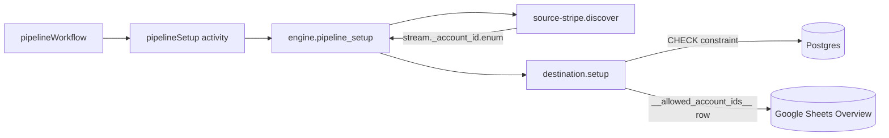

# `_account_id` enforcement in destinations

**Status:** Implemented
**Date:** 2026-04-26
**Canonical record:** [DDR-010](../architecture/decisions.md#ddr-010-_account_id-enforcement-in-destinations)

## Problem

A pipeline syncs data for a specific Stripe account. Today `_account_id` is just stamped on records — nothing at the storage layer enforces it. With `_raw_data jsonb` holding full API responses (payment_methods, charges, …), cross-account contamination is the risk.

## Design choice

The pipeline-wide allow-list rides on every stream's JSON Schema as `properties._account_id.enum`. A top-level `CatalogPayload.allowed_account_ids` was the obvious shape but would have introduced a parallel metadata channel every destination's schema-projection pipeline had to learn about. Stamping the enum keeps the existing JSON-Schema → DDL pipeline as the sole writer of constraints, and `discoverCache` stays account-agnostic (stamping happens per call).

## Architecture

## Implementation map

- `packages/source-stripe/src/catalog.ts` — `catalogFromOpenApi` injects `_account_id: { type: 'string' }`; `stampAccountIdEnum` layers the per-pipeline enum via a fresh spread.
- `packages/source-stripe/src/index.ts` — `discover()` resolves the account, computes the allow-list, yields a stamped catalog. Cache stays account-neutral.
- `packages/destination-postgres/src/schemaProjection.ts` — `buildCreateTableWithSchema` emits a standalone `DO $check$` block; `quoteAccountIdLiteral` enforces the `acct_*` shape; `getExistingAccountIdAllowLists` parses `pg_get_constraintdef()` for the mismatch check.
- `packages/destination-postgres/src/index.ts` — `setup()` calls `assertAllowListsConsistent` before any DDL.
- `packages/destination-google-sheets/src/writer.ts` — `ensureIntroSheet` writes the marker row; `readAllowedValues` reads it back, narrowing 400 "Unable to parse range" to "no allow-list yet".
- `packages/destination-google-sheets/src/index.ts` — `setup()` diffs the catalog enum against the Overview row before writing; `write()` validates every record against the read-back set.

## Notes

- **`NOT VALID` is intentional.** Existing rows are not retroactively checked; a follow-up can offer an opt-in `VALIDATE CONSTRAINT`.
- **Rotation is operator-driven.** Mismatches throw with a guiding error rather than silently rewriting the constraint — see DDR-010.
- **`additional_allowed_account_ids`** lives on the source spec. A destination-level allow-list (independent of source) can be added later without changing this design.
