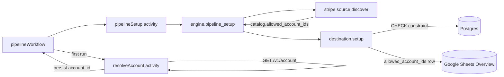

# `_account_id` enforcement in destinations

**Status:** Implemented
**Date:** 2026-04-26

## Problem

A pipeline syncs data for a specific Stripe account (e.g. `acct_123`).
Today, `_account_id` is just a value stamped on records — nothing at the
database level enforces that only `acct_123` data can land in that table.
A bug, misconfiguration, or data corruption could write `acct_456` records
into the wrong table.

We do store complete raw API responses as `_raw_data jsonb` — including
payment_methods, charges, and other sensitive objects. Cross-account
contamination is the real risk.

## Goals

- **Defense-in-depth:** each destination rejects writes whose `_account_id`
  falls outside the pipeline's allow-list, independent of engine
  correctness.
- **Single field on the wire:** the source publishes
  `CatalogPayload.allowed_account_ids: string[]`; destinations consume
  that one field. No JSON Schema overlay, no per-stream duplication.
- **Safe rollout:** existing Postgres tables get `NOT VALID` constraints;
  existing data is not retroactively rejected.

## Scope

This is intentionally `_account_id`-only. Destinations don't generalize
over arbitrary `const`/`enum` properties — `_account_id` is the single
tenancy boundary we care about, and the implementation reflects that.
A future need for additional constrained fields would be a separate
design.

## Two-layer solution

### Source layer

The Stripe source resolves the live account on `discover()` and produces
a catalog with the allow-list:

```jsonc
{
  "streams": [
    /* ... */
  ],
  "allowed_account_ids": ["acct_123"], // single account
}
```

```jsonc
{
  "streams": [
    /* ... */
  ],
  "allowed_account_ids": ["acct_123", "acct_456"], // multi-account aggregation
}
```

The list is `[account_id_from_api_key, ...config.additional_allowed_account_ids]`,
deduplicated. The `_account_id` schema property remains as plain
`{ type: 'string' }` — it's just a property descriptor, not a constraint.

### Destination layer

Each destination reads `catalog.allowed_account_ids` and enforces it
natively:

- **Postgres:**
  `CHECK ((_raw_data->>'_account_id') IS NOT NULL AND (_raw_data->>'_account_id') IN ('acct_123'))` —
  the database itself rejects invalid inserts.
- **Google Sheets:** the allow-list is written as a single JSON-encoded
  row to the Overview sheet during `pipeline_setup`, then validated on
  every write.

## Architecture



## Implementation

### Phase 1 — Protocol gains `allowed_account_ids`

- `packages/protocol/src/protocol.ts`: `CatalogPayload` and
  `ConfiguredCatalog` get an optional `allowed_account_ids: string[]`
  field. The engine's `buildCatalog` propagates it from the source's
  catalog message into the configured catalog handed to destinations.

### Phase 2 — Source publishes the allow-list

- `packages/source-stripe/src/index.ts` `discover()`:
  - Resolves the live account (`forceFetch: true` so a stale configured
    `account_id` cannot drift from the API key's account).
  - Computes `[account.accountId, ...config.additional_allowed_account_ids]`,
    deduplicates, and stamps `catalog.allowed_account_ids`.
  - The `discover` cache stays keyed on `apiVersion`. Stamping the
    allow-list happens on a fresh top-level spread of the cached
    catalog, so the cached object stays neutral.
- `packages/source-stripe/src/catalog.ts`: unchanged from before this
  PR — still injects `_account_id: { type: 'string' }` and marks it
  required, no const/enum.
- `packages/source-stripe/src/spec.ts`: keeps
  `additional_allowed_account_ids: z.array(z.string()).optional()` for
  multi-account aggregation.

### Phase 3 — Postgres destination: `CHECK` constraint on `_account_id`

- `packages/destination-postgres/src/schemaProjection.ts`:
  - `BuildTableOptions.allowed_account_ids?: string[]` is the single
    input that drives constraint emission. When set and non-empty,
    `buildCreateTableWithSchema` emits a CHECK on
    `_raw_data->>'_account_id'`.
  - Constraint name is the deterministic `chk_<table>__account_id`.
    Each setup emits `DROP CONSTRAINT IF EXISTS` + `ADD CONSTRAINT
… NOT VALID`, so a value change replaces the old predicate.
  - `applySchemaFromCatalog` accepts `allowed_account_ids` in its
    config and threads it through. The migration-marker fingerprint
    includes the allow-list so a value change re-triggers migration.
- `packages/destination-postgres/src/index.ts` `setup()`: passes
  `catalog.allowed_account_ids` into `buildCreateTableDDL` per stream.
- `buildCreateTableDDL` keeps the table-creation `DO $ddl$` block
  separate from the standalone `DO $check$` block (PL/pgSQL `DO` blocks
  cannot nest). The same standalone block applies to both new and
  existing tables.

### Phase 4 — Google Sheets destination: overview-backed validation

- `packages/destination-google-sheets/src/writer.ts`:
  - `ensureIntroSheet` accepts a single `allowedAccountIds?: string[]`.
    The Overview sheet gets one row tagged with the
    `__allowed_account_ids__` marker followed by `[{label}, {JSON list}]`.
  - `readAllowedValues` returns `Set<string> | undefined`.
- `packages/destination-google-sheets/src/index.ts`:
  - `setup()` reads `catalog.allowed_account_ids` directly and passes
    it to `ensureIntroSheet`.
  - `write()` calls `readAllowedValues` once and validates each
    record's `_account_id` against the set; mismatches throw and
    surface as `connection_status: failed`.

### Phase 5 — Tests

- Unit:
  - `packages/destination-postgres/src/schemaProjection.test.ts`:
    `allowed_account_ids` in options drives the CHECK; missing/empty
    skips it; multi-account emits an `IN (a, b)` predicate.
  - `packages/source-stripe/src/index.test.ts`: `discover()` populates
    `catalog.allowed_account_ids` from the API-key account plus
    `additional_allowed_account_ids`; the cached catalog stays
    `allowed_account_ids`-free.
  - `packages/destination-google-sheets/src/index.test.ts`: setup writes
    a single allow-list row to Overview; `readAllowedValues` returns the
    matching `Set`; `write()` rejects records whose `_account_id` is
    not in the set.
- E2E (Docker Postgres):
  - `packages/destination-postgres/src/index.test.ts` "schema-driven
    CHECK constraints": setup installs the constraint; Postgres rejects
    a wrong `_account_id` with `code: 23514` (check_violation); allows
    the matching value; multi-account allow-list works; repeated setup
    is idempotent; predicate change replaces the old constraint.

## Open design notes

- `additional_allowed_account_ids` lives on the Stripe source spec.
  If a destination-level allow-list (independent of source) becomes
  useful, it can be added later without changing this design.
- Postgres CHECKs are emitted as `NOT VALID` per the user's choice;
  a follow-up PR can offer an opt-in `VALIDATE CONSTRAINT` step once
  data has been audited.
- The in-memory `discoverCache` in the Stripe source is keyed by
  `apiVersion`. `allowed_account_ids` is layered on top of the cached
  catalog per call (one shallow spread), so different pipelines on the
  same `api_version` never collide.
